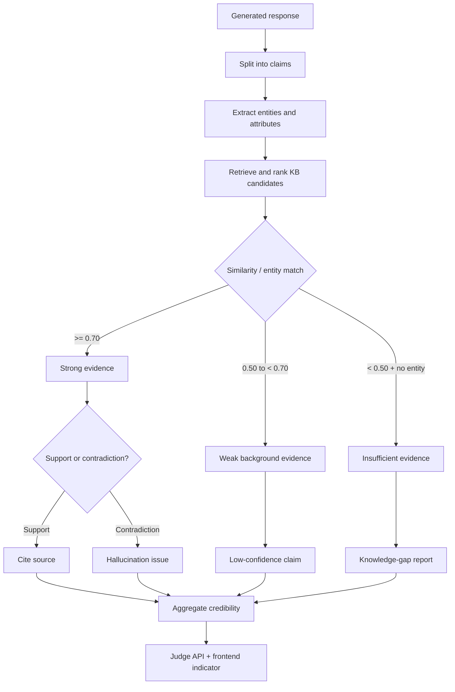

# Knowledge-Grounded Hallucination Detection

## Status

Approved design for implementation. The existing keyword detector remains available only as a weak risk signal and will no longer be sufficient to classify a response as hallucinated.

## Goals and non-goals

### Goals

- Judge factual claims against the existing knowledge base rather than confidence-related wording.
- Apply the agreed evidence thresholds: strong evidence `>= 0.70`, weak evidence `0.50–<0.70`, and insufficient evidence `<0.50` without an entity match.
- Return a structured knowledge-gap report when the evidence is insufficient; never invent a replacement fact.
- Attach every cited source as `[Document Name-Paragraph Number]`.
- Expose a four-level credibility indicator (`high`, `medium`, `low`, `no_evidence`) for the frontend and provide a one-click route to upload material.
- Keep the existing judge response contract compatible with persisted audit records and debate/correction flows.

### Non-goals

- Building a new embedding service or replacing Chroma.
- Treating semantic similarity as proof of entailment. Similarity supplies relevance; contradiction/support remains an explicit claim-level decision.
- Automatically uploading or generating knowledge-base documents.

## Architecture

The detector is a claim-level evidence pipeline in `HallucinationUtil`, called by `JudgeAgent`.

1. Normalize and split generated content into factual claims (sentence boundaries, bullets, and numbered items; empty fragments are discarded).
2. Extract lightweight entities/attributes from each claim (capitalized names, quoted terms, version numbers, dates, quantities, and domain tokens). This is deterministic and deliberately replaceable with a domain NER implementation later.
3. Build candidate evidence from the knowledge results already retrieved for the task. Candidates retain `title`, `content`, `similarity`, `doc_id`, and `slice_id`/`slice_index`. Claim candidates are ranked by semantic score when present, then by entity overlap and lexical overlap.
4. Classify evidence for each claim:
   - `strong_support`: top similarity `>= 0.70`; cite the source directly.
   - `weak_support`: top similarity `>= 0.50` and `< 0.70`; retain as background only and do not cite it as decisive support.
   - `contradiction`: an explicit numeric/version/value conflict with a candidate, or a constrained LLM verifier says the candidate contradicts the claim.
   - `insufficient_evidence`: top similarity `< 0.50` and no entity match, or no candidates.
5. Aggregate claim decisions. A response is `hallucination_detected=true` only when one or more claims are contradicted, or when a claim has a strong-relevance source but is not supported by that source. Unsupported claims with no strong source are reported as a knowledge gap, not a hallucination.
6. Calculate credibility:
   - `high`: all material claims have strong support and no contradictions.
   - `medium`: material claims are supported by a mixture of strong and weak evidence, with no contradiction.
   - `low`: at least one claim is unsupported/weakly supported, but the response still has some evidence.
   - `no_evidence`: no claim has a strong or weak source.
7. Format citations and the knowledge-gap report for API consumers.



## Interfaces

### Backend detector result

`HallucinationUtil.detect_hallucination()` keeps its existing tuple return type:

```python
Tuple[bool, Dict[str, Any]]
```

The detail dictionary is extended with this stable shape:

```python
{
    "is_hallucination": bool,
    "score": float,                 # 0..100 risk score
    "confidence": float,            # 0..1 evidence confidence
    "credibility": "high" | "medium" | "low" | "no_evidence",
    "evidence_coverage": float,     # material claims with >= 0.50 evidence
    "method": "knowledge_grounded" | "knowledge_gap" | "knowledge_grounded+llm" | "rules_fallback",
    "claims": [{
        "text": str,
        "status": "supported" | "weak_support" | "contradicted" | "insufficient_evidence",
        "similarity": float | None,
        "entities": list[str],
        "citations": list[str],
        "reason": str,
    }],
    "citations": [
        {"label": "[Document Name-Paragraph Number]", "title": str,
         "paragraph": int, "doc_id": int | None, "slice_id": int | None}
    ],
    "knowledge_gap": {
        "present": bool,
        "claims": list[str],
        "entities": list[str],
        "attributes": list[str],
        "upload_prompt": str,
    },
    "detected_keywords": list[str],  # diagnostic only; never decisive
    "contradictions": list[dict],
    "layer": str,
}
```

`reference_knowledge` entries may use either `slice_index` or `paragraph`; paragraph numbering is normalized to one-based integers for citations. Missing or malformed similarity values are treated as `0.0`, never as strong evidence.

### Judge result compatibility

`JudgeAgent.execute()` continues to return `hallucination_detected`, `hallucination_score`, `issues`, `corrections`, `source_slice_ids`, and `source_doc_ids`. New top-level fields mirror the detector result:

```python
{
    "credibility": str,
    "evidence_coverage": float,
    "citations": list[dict],
    "knowledge_gap": dict,
}
```

Hallucination issues use `type: "hallucination_evidence"` and include the claim, status, reason, and citation labels. `hallucination_keyword` is retained only for backward-compatible reads of old records; new audits do not emit it.

### Frontend types and interaction

Add report types matching the camelCase API response:

```ts
type Credibility = 'high' | 'medium' | 'low' | 'noEvidence'

interface HallucinationClaim {
  text: string
  status: 'supported' | 'weakSupport' | 'contradicted' | 'insufficientEvidence'
  similarity: number | null
  entities: string[]
  citations: string[]
  reason: string
}

interface HallucinationReport {
  detected: boolean
  score: number
  confidence: number
  credibility: Credibility
  evidenceCoverage: number
  claims: HallucinationClaim[]
  citations: Array<{ label: string; title: string; paragraph: number; docId?: number; sliceId?: number }>
  knowledgeGap: {
    present: boolean
    claims: string[]
    entities: string[]
    attributes: string[]
    uploadPrompt: string
  }
}
```

The audit/report consumer renders a badge with the four labels. For `noEvidence`, the badge includes a primary action linking to `/knowledge-base` (the existing upload screen). Citation labels are rendered verbatim as footnotes; weak references are shown under background evidence and are not presented as authoritative.

## Scoring and calibration

- Relevance thresholds are constants/configuration, defaulting to `0.70` and `0.50`.
- Entity match can upgrade a `<0.50` candidate to `weak_support` only when the candidate contains the same normalized entity and no contradiction is detected; it cannot upgrade to `strong_support`.
- Contradictions receive the highest risk contribution. Unsupported claims contribute a lower risk contribution and primarily lower credibility.
- The legacy keyword score is stored as `keyword_score` for diagnostics and contributes at most 10% of the final risk score when no evidence is available; it cannot make a response hallucinated by itself.
- A calibration script/test fixture will accept labeled claims and emit ROC points for threshold review. Runtime defaults remain deterministic until calibrated values are explicitly configured.

## Exception handling and graceful degradation

- Empty content: return a zero-risk, `no_evidence` result with an empty claim list.
- Empty knowledge base: return `hallucination_detected=false`, `method="knowledge_gap"`, and a populated knowledge-gap report.
- Chroma/search failure: log the failure, use any supplied database results, and return `method="rules_fallback"` if none exist.
- Invalid similarity, missing titles, or missing slice IDs: keep the claim decision but omit the malformed citation; never fabricate a source label.
- LLM verifier timeout/invalid JSON: keep deterministic support/contradiction checks and mark `method` without `+llm`.
- Frontend missing fields: default to `noEvidence`, empty arrays, and hide citations rather than crashing the report page.

## Testing strategy

- Add failing regression tests before implementation for keyword-only false positives, strong support with a citation, weak support, contradiction, entity-match fallback, and empty-knowledge knowledge-gap output.
- Test citation formatting, malformed evidence, LLM failure, and JudgeAgent backward-compatible fields.
- Add frontend tests for all four credibility levels and the upload action.
- Run backend unit tests and the focused frontend report tests, then the project type/lint checks available in the repository.

## Acceptance criteria

1. Phrases such as “certainly” or “possibly” do not independently produce a hallucination issue.
2. A claim backed by a `similarity >= 0.70` slice is marked supported and has a `[title-paragraph]` citation.
3. A `0.50 <= similarity < 0.70` slice is surfaced as background evidence and lowers confidence without being cited as decisive.
4. A claim below `0.50` with no entity match produces a knowledge-gap entry and upload guidance.
5. Explicit conflicts are marked contradicted and set `hallucination_detected=true`.
6. The frontend displays high/medium/low/no-evidence credibility and links no-evidence users to the knowledge-base upload flow.

