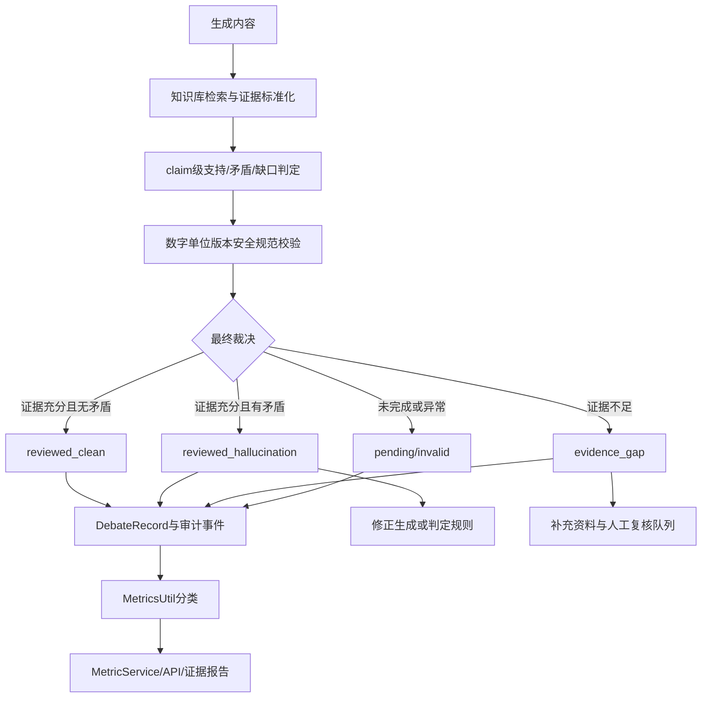

# 量化指标幻觉率治理设计

## 状态

待用户审阅。本文档只定义量化口径、证据治理和验收方案，不在本阶段修改业务代码。

## 1. 背景与成功标准

当前全系统幻觉率为 `3/53 = 5.66%`。分子是已完成证据审查且确认存在幻觉的记录，分母是已完成的证据审查记录；`insufficient_evidence`、知识缺口和未完成审查不进入分子或分母。当前报告中的 88 条待审查和 123 条证据缺口沿用旧版独立计数，可能重叠，不能相加作为样本量；治理后的统一分类会让两类状态互斥。

目标是让正式验收口径下的幻觉率严格小于 `5.00%`，同时保证每个统计结论都能回溯到生成内容、知识库证据、裁判决策和复核结果。成功标准如下：

1. 复核现有 3 条确认记录，只有证据证明误判时才更正；真实幻觉不得删除、隐藏或改写为证据缺口。
2. 证据缺口、待人工复核、已确认幻觉和已确认无幻觉在接口、看板和报告中分开显示。
3. 统计公式、样本窗口、最小样本量和验收门槛固定且版本化，不能为达标临时改变分母。
4. 真实生产样本在正式验收窗口内满足幻觉率 `<5.00%`，并通过高风险内容复核覆盖率和数据质量门禁。

### 当前基线

| 项目 | 当前值 | 说明 |
| --- | ---: | --- |
| 已完成证据审查 `E` | 53 | 可进入正式分母的审查记录 |
| 已确认幻觉 `H` | 3 | 仅限证据充分且已裁决的记录 |
| 当前幻觉率 | 5.66% | `H / E * 100` |
| 待审查 `P` | 88 | 当前旧报告计数；尚未形成最终裁决，不计入分母 |
| 证据缺口 `G` | 123 | 当前旧报告计数；没有足够证据，不计入分子或分母 |
| 目标 | `<5.00%` | 严格小于，不接受等于 5% |

若 3 条确认幻觉全部保留，新增样本必须是完成证据审查且非幻觉的真实样本；最少新增 8 条，达到 `3/61 = 4.92%`。通用计算式为：

```text
需要新增的合格样本 = max(0, floor(20 * H - E) + 1)
```

该计算只表示在保持 H 不变时满足严格 `<5%` 所需的新增合格样本，不包含正式最小样本量门槛；当 E 仍低于门槛时，必须继续按门槛补样。它只用于排期，不替代质量改进；新增样本不能通过挑选容易通过的内容获得。

## 2. 范围与约束

### 范围

- `MetricsUtil.calculate_hallucination_metrics` 的分类和统计口径。
- `MetricService`、幻觉率接口、系统健康检查和证据报告的一致性。
- `JudgeAgent`/`HallucinationUtil` 的证据状态、风险校验和审查结果持久化。
- 复核、纠错、补样和发布验收流程。
- 后端单元测试、接口测试和指标证据报告测试。

### 非目标

- 不新建 embedding、向量库或新的 LLM 服务。
- 不删除历史 `DebateRecord`，不覆盖原始内容，不伪造专家标注。
- 不把关键词命中、语气词（如“可能”“一定”）或低相似度本身当作幻觉事实。
- 不通过修改统计时间窗、降低样本门槛或排除不利样本来降低结果。
- 不在本方案内处理答题正确率、资源匹配效果等其他指标；它们只作为关联监控项保留。

### 关键假设

- 现有知识库检索结果包含 `title`、`content`、`similarity`，并可提供 `slice_id`/`slice_index` 或等价段落信息。
- `DebateRecord` 是一次生成输出的审核记录；多轮辩论中只有最终完成审查的记录进入 `E`，中间未决记录保持为待审查。
- 数据库备份和迁移由现有 Alembic 流程管理；任何历史更正使用追加审计记录而非删除原记录。

## 3. 方案取舍

### 方案 A：只调整阈值或扩大分母

实现成本最低，但会把不确定性伪装成准确性，无法解释 3 条确认记录，也无法通过审计。放弃。

### 方案 B：证据分层的审查闭环（推荐）

沿用现有 `HallucinationUtil` 的知识库检测，统一证据状态和指标分类；对确认幻觉修复生成/判定规则，对证据缺口引导补充资料，再用分层抽样补齐真实合格样本。改动集中在已有模块，成本可控，且能解释每一个分子和分母。采用。

### 方案 C：所有样本都调用 LLM 双重裁决

可以提升边界样本的召回率，但成本、延迟和模型漂移较大；LLM 不能替代原始证据。仅把它作为高风险或边界记录的复核器，不作为唯一判定来源。

## 4. 领域模型与统计口径

### 4.1 审查状态

每条记录必须能归入以下互斥状态。首期不做表结构迁移，继续使用现有 `resolution_status`、`judge_decision`、`is_hallucination` 和 JSON 审查详情承载数据，并新增统一的标准审查 JSON；实现时由一个集中分类函数输出状态，禁止各接口自行猜测。

| 状态 | 判定条件 | 是否计入分母 `E` | 是否计入分子 `H` |
| --- | --- | ---: | ---: |
| `reviewed_clean` | 证据充分、已完成裁决、未发现矛盾 | 是 | 否 |
| `reviewed_hallucination` | 证据充分、已完成裁决，存在可复现矛盾或确认的高风险事实错误 | 是 | 是 |
| `evidence_gap` | 无来源、来源相似度不足或无法完成事实比对 | 否 | 否 |
| `pending_review` | 尚未完成最终裁决，或仍在辩论/人工复核 | 否 | 否 |
| `invalid_record` | 必填字段损坏、证据格式不可解析或重复键冲突 | 否 | 否 |

`evidence_gap` 和 `pending_review` 必须单独返回计数与明细。`invalid_record` 不得静默丢弃，应计入数据质量告警。

现有字段的兼容映射：

- 完成状态：`resolution_status in {resolved, reviewed, verified}` 或 `judge_decision in {approved, rejected, confirmed, resolved}`。
- 证据缺口：审查详情中出现 `knowledge_gap`、`no_reference`、`evidence_gap`、`insufficient_evidence` 等标准标记时，优先归为 `evidence_gap`，即使旧记录的 `is_hallucination=true`。
- 确认幻觉：只在完成状态、无证据缺口且 `is_hallucination=true` 时计入 `reviewed_hallucination`；最好同时存在 `hallucination_evidence` 矛盾、可定位引用或人工确认。
- 关键词命中只保留为诊断字段；单独的 `hallucination_keyword` 不能把记录变成确认幻觉。

只有在历史 JSON 无法稳定归类或查询性能成为实际瓶颈时，才另行提出 Alembic 迁移，增加显式的 `evidence_status`、`review_outcome`、`reviewed_at` 和 `review_source` 字段；迁移前后必须用同一批数据做对照，不能借迁移改变历史结果。

### 4.2 幻觉率公式

```text
幻觉率(%) = H / E * 100
H = reviewed_hallucination 数量
E = reviewed_clean + reviewed_hallucination 数量
```

统计服务继续返回 `total_checks`、`evaluated_checks`、`pending_checks`、`confirmed_hallucinations`、`evidence_gaps`、`hallucination_rate`、`pass_rate` 和 `has_sufficient_sample`。其中：

- `evaluated_checks = E`，而不是所有 `DebateRecord` 数量。
- `pass_rate = (E - H) / E * 100`，只作为辅助指标。
- `hallucination_rate` 在样本门槛不足时返回 `null`，禁止用 0 代替“没有足够证据”。
- 报告应增加 `invalid_records`、`metric_policy_version` 和 `window`，方便复核。

### 4.3 验收门槛

- 看板实时值：`E >= 10` 后可展示开发态数值，但标记为 `development_validation`。
- 正式验收：`E >= 60`、幻觉率严格 `<5.00%`、高风险记录复核覆盖率 `100%`、无未处理的 `invalid_record`。
- 当前基线若 H 仍为 3，必须达到 `E >= 61` 才能通过严格目标；若复核后 H 变化，按公式重新计算，不预先承诺样本数。
- 同时展示全量累计值和最近 30 天滚动值；正式发布要求两者都不违反 `<5.00%`，且滚动窗口至少有 30 条合格审查。若窗口样本不足，状态为 `insufficient_evidence`。
- 任何一次高风险内容发布前都必须有完成的证据审查；检索失败时不能标记为 `reviewed_clean`。

## 5. 系统架构

### 5.1 组件职责

1. `HallucinationUtil`：拆分事实 claim，关联知识切片，输出 `supported`、`weak_support`、`contradicted`、`insufficient_evidence` 及引用。关键词层只能提供风险信号。
2. `JudgeAgent`：汇总 claim 结果、数值/单位/版本/安全规范校验和行业规则，给出最终裁决与修正建议。
3. `TaskRepository`：保存原始内容、证据、裁决、修正内容和审查时间；更正采用追加记录或带版本的审计事件。
4. `MetricsUtil`：集中完成记录分类、样本过滤和公式计算，不负责修改业务记录。
5. `MetricService`：应用指标定义、最小样本、时间窗和状态策略，供接口、健康检查和报告复用。
6. `generate_metric_evidence.py`：生成带公式、分子、分母、状态和版本的证据报告；报告默认不包含模型密钥或原始凭据。

### 5.2 数据流



### 5.3 高风险校验

高风险校验只负责提升复核优先级和发现明确错误，不把模糊风险直接算作幻觉：

- 数字、百分比、时间、版本和单位：先规范化，再仅在同一实体/属性上比较；来源中出现无关的其他年份或数字不能直接判冲突。
- 安全、法规、操作禁令：必须有可定位的权威来源；无来源归为 `evidence_gap`，与来源明确矛盾才归为幻觉。
- 主题/实体混淆：检索到的实体与 claim 不一致时降低证据等级，不能仅凭相似度判支持。
- 绝对化和不确定性词：作为语言风险提示；没有事实矛盾时不计入 `H`。
- 边界相似度（弱支持）和规则冲突：进入人工或第二裁判复核队列，最终结果未确定前保持 `pending_review`。

## 6. 复核与改进闭环

### 阶段一：复核当前 3 条

1. 导出每条记录的原始生成内容、检索切片、claim、判定理由、引用和最终决策。
2. 由独立复核者逐条确认：是否存在同一事实的证据冲突、引用是否可定位、是否只是证据缺口或关键词误报。
3. 误判只通过追加更正事件修复，并保留原记录、复核者、理由、时间和前后值；真实幻觉继续保留在 `H`。
4. 重新生成对照报告，记录复核前后 `H/E` 变化和变更原因。

### 阶段二：修复检测与生成链路

- 删除关键词单独触发确认幻觉的路径；保留 `detected_keywords` 作为诊断。
- 修正数值、单位、版本和安全规范的比较规则，增加同实体约束和来源定位。
- 生成内容优先引用检索切片；证据不足时输出知识缺口并阻止自动发布或进入人工队列。
- 修正后重新审查最终内容；中间辩论记录保持未决，只有最终裁决进入 `E`。

### 阶段三：补充合格样本

- 从真实生产流按时间、行业、资源类型、模型版本和风险等级分层抽样，避免只选择低风险样本。
- 所有高风险/冲突样本 100% 复核；普通样本使用固定比例的独立抽样，并记录抽样种子和范围。
- 只有有来源、已完成裁决的样本才能增加 `E`；知识缺口和自动生成的自证样本不能用于达标。
- 若 3 条确认幻觉均保留，先完成至少 8 条合格非幻觉审查达到 `E=61`，再按滚动窗口继续观察，避免一次性样本导致回归。

## 7. 异常处理与安全

- 内容为空：不创建可验收审查记录；若已有记录，则归为 `invalid_record`，不计入 `E`。检测器可以返回 `no_evidence` 供调用方显示，但这不是已完成审查状态。
- 知识库为空：返回 `evidence_gap`，提供补充资料提示，不标记为 clean 或 hallucination。
- 检索/向量库失败：记录错误和 trace id；使用已有证据进行复核，否则进入人工队列并阻止自动发布。
- 相似度、段落号、标题格式错误：保留可验证的判定，省略无法验证的引用，记录 `invalid_record` 数据质量问题；绝不编造来源。
- LLM 超时或返回非法 JSON：回退到确定性规则；无法形成证据结论时为 `pending_review`，不默认通过。
- 重复审查或并发写入：以任务和最终审查版本做幂等键，冲突写入失败并告警，不能重复增加分母。
- 指标计算异常：接口返回明确错误状态和上次可用快照；不以 0 覆盖未知值。
- 报告和日志只使用脱敏模型名、记录 ID 和引用摘要；发现历史密钥或 token 时立即清理并在服务商侧轮换，不能写入设计文档或报告。

## 8. 接口与报告契约

`GET /api/v1/agent/metrics/hallucination` 和报告服务使用同一 `MetricService` 结果。响应至少包含：

```json
{
  "hallucination_rate": 4.92,
  "confirmed_hallucinations": 3,
  "evaluated_checks": 61,
  "pending_checks": 88,
  "evidence_gaps": 123,
  "invalid_records": 0,
  "has_sufficient_sample": true,
  "minimum_sample_size": 60,
  "target": 5.0,
  "operator": "<",
  "status": "passed",
  "metric_policy_version": "hallucination-rate-v1"
}
```

示例中的数值只说明字段形状，不能作为验收数据。实际报告必须同时提供 `numerator`、`denominator`、计算时间、时间窗、数据源字段、样本明细链接和排除原因摘要。历史趋势保留旧快照，但明确标记旧口径，不与新口径混合绘图。

## 9. 测试方案

### 单元测试

- 证据充分且支持：`reviewed_clean`，有正确引用。
- 证据充分且数字/版本/安全规范冲突：`reviewed_hallucination`。
- 弱支持、无来源、知识缺口：`evidence_gap`，不增加 `H` 或 `E`。
- 未决记录、非法 JSON、缺少引用字段、重复记录：分别进入 `pending_review` 或 `invalid_record`。
- 关键词、绝对化词和不确定性词单独出现：不产生确认幻觉。
- `H=3,E=53` 返回 5.66%；`H=3,E=61` 返回 4.92%；`H=3,E=60` 不通过严格 `<5%`。
- 分母不足、无数据和 `E=0` 返回 `null` 而非 0。

### 集成与接口测试

- `MetricsUtil`、`MetricService`、健康检查、报告服务和幻觉率 API 的分子/分母一致。
- 时间窗、learner scope 和最近 30 天窗口过滤一致。
- 最终辩论记录才进入 `E`，中间轮次不会重复计数。
- 证据报告包含 policy version、状态计数和排除原因，且不泄露敏感配置。

### 回归与验收测试

- 使用当前数据库备份生成基线报告，改动后做 H/E、证据缺口和待审查数量的逐项对照。
- 在固定标注夹具上验证高风险规则的误报/漏报；边界样本至少由两名复核者或一名专家加规则复核。
- 全量后端测试、指标相关测试和报告脚本测试通过后，才允许把状态从开发态切换为正式验收。

## 10. 发布、监控与回滚

1. 先以只读模式上线分类和报告，对比一周，不改变发布门禁。
2. 完成 3 条复核、规则修复和合格补样后，再启用正式 `<5%` 门禁。
3. 每日记录全量累计率、30 天滚动率、`H/E`、证据缺口率、待审查积压和高风险复核覆盖率；任一门禁失败自动降级为人工审核。
4. 规则或口径变更必须提升 `metric_policy_version` 并生成前后对照报告。
5. 若新规则造成误报、检索不可用或指标不一致，回滚到上一版本代码和 policy version；审计记录和原始数据保留不动。

## 11. 验收清单

- [ ] 当前 3 条已逐条完成证据复核，并有可定位结论。
- [ ] 关键词误报、数字/单位/版本/安全规范规则有回归测试。
- [ ] `evidence_gap`、`pending_review`、`reviewed_clean`、`reviewed_hallucination`、`invalid_record` 统计互斥且可解释。
- [ ] 指标 API、健康检查和证据报告使用同一计算服务与 policy version。
- [ ] 正式窗口 `E>=60`（当前 H=3 时 `E>=61`）、全量和 30 天滚动幻觉率均 `<5.00%`。
- [ ] 高风险记录复核覆盖率为 100%，无未处理的非法记录。
- [ ] 报告、日志、测试夹具和提交内容不含真实密钥、token 或密码。
